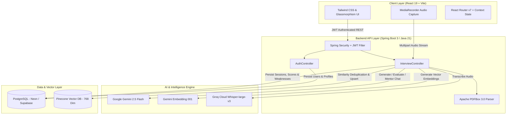

# 🎯 PREPMATE — AI-Powered Technical Interview Coach & Mastery Platform

<div align="center">


<p align="center">
  <b>PrepMate</b> is a full-stack, AI-native technical interview simulator and intelligent preparation coach.<br/>
  It combines <b>semantic vector memory</b>, <b>real-time voice transcription</b>, <b>resume parsing</b>, and <b>spaced-repetition practice</b> to help developers master technical interviews with pinpoint AI grading and actionable feedback.
</p>

</div>

---

## 🌟 Key Features & Engineering Highlights

### 1. 🤖 Dynamic AI Interview Simulations
- **Granular Customization**: Generates real-time interview questions calibrated by domain (e.g., Spring Boot, Distributed Systems, React), target experience level (*Junior, Intermediate, Senior, Lead*), question quantity, and question style (*Definitions, Conceptual Trade-offs, Scenario-Based*, or *Mixed*).
- **Strict Interview-Grade Prompts**: Formatted directly through Google Gemini (`gemini-2.5-flash`) to mirror real FAANG/tier-1 tech interviewer questioning styles under 40 words with zero fluff or premature hints.

### 2. 📄 Intelligent Resume-Based Interview Assessments
- **Document Text & PDF Parsing**: Ingests PDF resumes directly using **Apache PDFBox 3.0** (`Loader.loadPDF` & `PDFTextStripper`) or raw pasted resume profiles.
- **Project-Specific Question Generation**: Extracts stated skills, project architectures, databases, and programming languages to conduct tailored technical deep-dive examinations targeting candidate claims.

### 3. 🎙️ Real-Time Voice-to-Text with Groq Whisper
- **Ultra-Low Latency Speech Recognition**: Seamless in-browser audio capture via HTML5 `MediaRecorder` API (`audio/webm`), streamed straight to **Groq Cloud's `whisper-large-v3`** model.
- **Hands-Free Mock Interviews**: Candidates can speak answers naturally, with automatic speech-to-text transcription appended directly into the active question answer box in real-time.

### 4. 🧠 Semantic Question Deduplication (Pinecone Vector DB + Gemini Embeddings)
- **High-Dimensional Vector Embeddings**: Questions are embedded into 768-dimensional vectors using Google Gemini's `gemini-embedding-001` model.
- **Cosine Similarity Filtering**: Before questions reach the candidate, PrepMate performs a vector query against the user's mastered namespace in **Pinecone**. Questions with a cosine similarity score $> 0.85$ are automatically rejected and regenerated to eliminate repeat questions and ensure continuous learning.

### 5. 🔁 Spaced-Repetition Weakness Practice Engine
- **Automated Failure Tracking**: When a candidate scores below **70%** on any question, the concept is automatically persisted to PostgreSQL with spaced-repetition metadata (`next_practice_date = now + 1 day`, `consecutive_failures`).
- **Concept Variation Generation**: The practice module retrieves due weak concepts and instructs Gemini to generate novel questions testing the exact same underlying concept with alternate phrasing, preventing rote memorization.

### 6. 📊 Question-by-Question Deep Analytics & Grading
- **Comprehensive Score Reports**: Detailed percentage score (0–100), key strengths, critical weaknesses, and actionable improvement suggestions.
- **Model Suggested Answers**: Concise model answers (maximum 7 sentences / 150 words) displaying optimal interview communication structure and necessary code snippets.

### 7. 💬 24/7 AI Mentor / Doubt Assistant
- **In-Session & On-Demand Guidance**: Built-in chat assistant powered by Gemini for instant doubt clarification, algorithmic breakdown, and conceptual deep-dives formatted in clean, rich Markdown.

### 8. 🔒 Production-Grade Security & Profile Segregation
- **Stateless JWT Authentication**: Secure password hashing with BCrypt; all protected endpoints are strictly safeguarded with Spring Security 6 filter chains.
- **Environment Isolation**: Local development configuration (`application-local.properties`) is decoupled from production settings (`application.properties`), which strictly pulls secured system environment variables.

---

## 🏗️ System Architecture



---

## 🛠️ Technology Stack

| Domain | Technologies & Libraries |
| :--- | :--- |
| **Backend Framework** | Java 21, Spring Boot 3.x / 4.x, Spring Data JPA, Spring Security 6 |
| **Authentication & Tokens** | JSON Web Tokens (`jjwt-api`, `jjwt-impl`, `jjwt-jackson` 0.12.5), BCrypt |
| **AI & LLM Services** | Google Gemini API (`gemini-2.5-flash`), Gemini Embeddings (`gemini-embedding-001`) |
| **Speech-to-Text** | Groq Cloud API (`whisper-large-v3`) |
| **Vector Database** | Pinecone (Cosine Similarity search, 768 dimensions) |
| **Primary Database** | PostgreSQL 16 (Neon Serverless PostgreSQL), HikariCP Pool |
| **Document Processing** | Apache PDFBox 3.0.1 (PDF parsing & text extraction) |
| **Frontend Framework** | React 19, Vite 8, React Router DOM 7 |
| **Styling & UI** | Tailwind CSS v4, PostCSS, Lucide React Icons, React Markdown |
| **DevOps & CI/CD** | Docker (Multi-stage builds), GitHub Actions CI, Maven |

---

## 📁 Repository Structure

```
PREPMATE/
├── .github/
│   └── workflows/
│       └── ci.yml               # Automated CI for frontend (Node 22) and backend (JDK 21)
├── backend/
│   ├── src/
│   │   ├── main/
│   │   │   ├── java/prepmate/
│   │   │   │   ├── PrepmateApplication.java
│   │   │   │   ├── ai/          # GeminiService, GroqService, PineconeService
│   │   │   │   ├── auth/        # AuthController, User entity, UserRepository
│   │   │   │   ├── common/      # Global exceptions and utilities
│   │   │   │   ├── interview/   # InterviewController, entities & DTOs
│   │   │   │   └── security/    # SecurityConfig, JwtAuthFilter, JwtUtils
│   │   │   └── resources/
│   │   │       ├── application.properties
│   │   │       └── application-local.properties
│   │   └── test/
│   ├── .env.example             # Backend environment configuration template
│   ├── Dockerfile               # Backend Docker containerization
│   └── pom.xml                  # Maven dependencies & build definitions
├── frontend/
│   ├── public/                  # Static assets & icons
│   ├── src/
│   │   ├── app/                 # Router and root App component
│   │   ├── components/          # Reusable UI cards, buttons, layouts
│   │   ├── contexts/            # ThemeContext & UI states
│   │   ├── features/            # Feature modules (auth, dashboard, interview, history, chatbot, profile)
│   │   └── services/            # Axios API client & interceptors
│   ├── .env.example             # Frontend environment configuration template
│   ├── Dockerfile               # Frontend Docker containerization
│   ├── package.json             # NPM dependencies & scripts
│   └── vite.config.js           # Vite configuration
└── README.md
```

---

## 🚀 Getting Started

### Prerequisites
Make sure you have the following installed on your local machine:
- **Java Development Kit (JDK) 21** or higher
- **Node.js 20+** and **npm**
- **PostgreSQL database** (or free serverless instance on [Neon](https://neon.tech))
- API Keys for:
  - [Google AI Studio](https://aistudio.google.com/) (Gemini API)
  - [Groq Cloud Console](https://console.groq.com/) (Whisper Speech API)
  - [Pinecone](https://www.pinecone.io/) (Vector Database index with dimension = 768 and cosine metric)

---

### 1. Clone the Repository
```bash
git clone https://github.com/maheshthammappa/prepmate.git
cd prepmate
```

---

### 2. Backend Setup
1. Navigate to the backend directory:
   ```bash
   cd backend
   ```
2. Create and configure your environment variables:
   - Copy `.env.example` to your environment or configure `src/main/resources/application-local.properties`:
   ```properties
   # PostgreSQL Configuration
   spring.datasource.url=jdbc:postgresql://localhost:5432/prepmatedb
   spring.datasource.username=postgres
   spring.datasource.password=your_password

   # AI & External APIs
   gemini.api.url=https://generativelanguage.googleapis.com/v1beta/models/gemini-2.5-flash:generateContent
   gemini.api.key=YOUR_GEMINI_API_KEY
   groq.api.key=YOUR_GROQ_API_KEY
   pinecone.api.key=YOUR_PINECONE_API_KEY
   pinecone.index.host=https://YOUR_INDEX_HOST.pinecone.io

   # JWT Security
   jwt.secret=YOUR_256_BIT_SECRET_KEY_HERE
   frontend.url=http://localhost:5173
   ```
3. Run the Spring Boot application:
   ```bash
   # On macOS/Linux
   ./mvnw spring-boot:run

   # On Windows
   mvnw.cmd spring-boot:run
   ```
   The backend will be available at `http://localhost:8080`.

---

### 3. Frontend Setup
1. In a new terminal window, navigate to the frontend directory:
   ```bash
   cd frontend
   ```
2. Create your `.env.local` file from the template:
   ```bash
   cp .env.example .env.local
   ```
   Ensure the API endpoint is configured:
   ```env
   VITE_API_BASE_URL=http://localhost:8080
   ```
3. Install dependencies and start the development server:
   ```bash
   npm install
   npm run dev
   ```
   The application will be accessible at `http://localhost:5173`.

---

## 📡 REST API Reference

### Authentication (`/api/auth`)
| Method | Endpoint | Description | Auth Required |
| :--- | :--- | :--- | :---: |
| `POST` | `/api/auth/register` | Register a new user account | No |
| `POST` | `/api/auth/login` | Authenticate user and receive JWT token | No |
| `GET` | `/api/auth/check-username` | Check username availability in real-time | No |
| `GET` | `/api/auth/ping` | Health check endpoint | No |
| `GET` | `/api/auth/me` | Fetch authenticated user profile details | Yes |
| `PUT` | `/api/auth/profile` | Update username, email, and biography | Yes |

### Interview & AI Engine (`/api/interview`)
| Method | Endpoint | Description | Auth Required |
| :--- | :--- | :--- | :---: |
| `POST` | `/api/interview/generate` | Generate questions with vector deduplication | Yes |
| `POST` | `/api/interview/generate-from-resume` | Generate custom questions from PDF / resume text | Yes |
| `POST` | `/api/interview/transcribe` | Transcribe voice recording via Groq Whisper | Yes |
| `POST` | `/api/interview/evaluate` | Evaluate answers, calculate scores & update vector memory | Yes |
| `POST` | `/api/interview/practice-generate` | Generate spaced-repetition practice questions | Yes |
| `GET` | `/api/interview/mastered-questions` | Fetch paginated list of mastered questions | Yes |
| `GET` | `/api/interview/history` | List user's historical interview sessions | Yes |
| `GET` | `/api/interview/history/{id}` | Fetch full question evaluation details by session ID | Yes |
| `POST` | `/api/interview/ask-doubt` | Chat with AI Mentor for instant doubt resolution | Yes |

---

## 🧪 Testing & CI Pipeline

The project includes an automated GitHub Actions CI workflow running on every push and pull request to `main`:
- **Frontend**: Dependency installation, Oxlint linting, and Vite production bundle compilation.
- **Backend**: JDK 21 setup, Maven automated test execution, and application packaging.

Run tests locally:
```bash
# Backend unit tests
cd backend && ./mvnw test

# Frontend linting
cd frontend && npm run lint
```

---

## 📄 License

This project is open source and available under the [MIT License](LICENSE).
