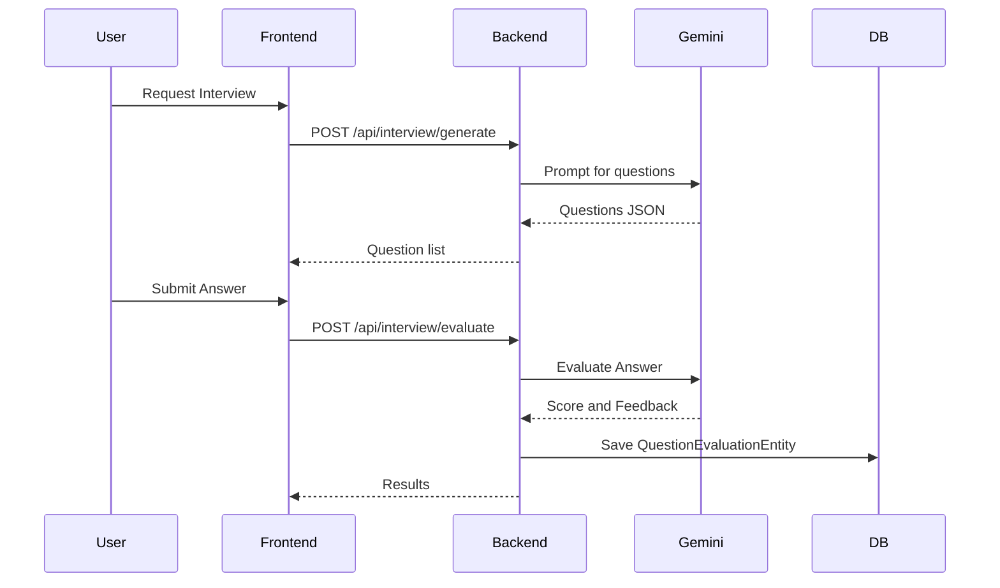

# Data Flow

```mermaid
sequenceDiagram
    participant User
    participant Frontend
    participant Backend
    participant Gemini
    participant DB
    User->>Frontend: Request Interview
    Frontend->>Backend: POST /api/interview/generate
    Backend->>Gemini: Prompt for questions
    Gemini-->>Backend: Questions JSON
    Backend-->>Frontend: Question list
    User->>Frontend: Submit Answer
    Frontend->>Backend: POST /api/interview/evaluate
    Backend->>Gemini: Evaluate Answer
    Gemini-->>Backend: Score and Feedback
    Backend->>DB: Save QuestionEvaluationEntity
    Backend-->>Frontend: Results
```
