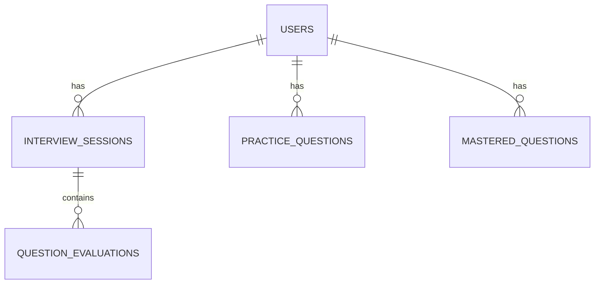

# Schema Diagram

```mermaid
erDiagram
    USERS ||--o{ INTERVIEW_SESSIONS : "has"
    USERS ||--o{ PRACTICE_QUESTIONS : "has"
    USERS ||--o{ MASTERED_QUESTIONS : "has"
    INTERVIEW_SESSIONS ||--o{ QUESTION_EVALUATIONS : "contains"
```
